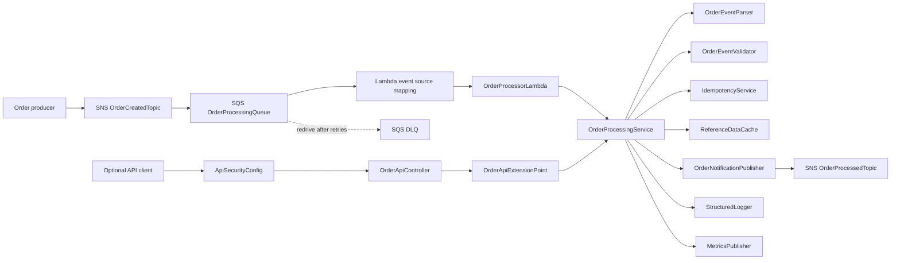

# AWS Order Processor

Production-ready Spring Boot 3 Maven project for event-driven order processing:

```text
SNS OrderCreatedTopic -> SQS OrderProcessingQueue -> AWS Lambda -> SNS OrderProcessedTopic
```

See the high-level architecture diagram in `docs/architecture.md`.

The Lambda handler is:

```text
com.prasanna.interview.handler.OrderProcessorLambda::handleRequest
```

It implements `RequestHandler<SQSEvent, SQSBatchResponse>`, iterates SQS records, extracts the SNS envelope from each SQS body, deserializes the SNS `Message` into Java records, processes `DigitalOrder` and `PhysicalOrder` with a pattern matching switch, and publishes an `OrderProcessedEvent` to:

```text
arn:aws:sns:ap-southeast-4:<account-id>:OrderProcessedTopic
```

## Architecture And Code Component Map

The production path is event-driven. The optional API path is an adapter that reuses the same application service and does not replace the SNS/SQS Lambda flow.



Code interaction summary:

| Concern | AWS or runtime component | Code component |
| --- | --- | --- |
| Input fan-out | `OrderCreatedTopic` SNS topic | Producers publish SNS messages containing order JSON. |
| Durable buffering and retry | `OrderProcessingQueue` SQS queue | `OrderProcessorLambda` receives `SQSEvent` batches. |
| Partial batch failure | Lambda SQS event source mapping | `OrderProcessorLambda` returns `SQSBatchResponse` with only failed SQS message ids. |
| Core workflow | Spring Boot application service | `OrderProcessingService` validates payload size, unwraps SNS, parses, validates, deduplicates, processes, logs, emits metrics, and publishes. |
| Order type behavior | Java sealed records and pattern matching | `OrderEvent`, `DigitalOrder`, `PhysicalOrder`, and the switch in `OrderProcessingService`. |
| Output notification | `OrderProcessedTopic` SNS topic | `OrderNotificationPublisher` uses AWS SDK v2 `SnsClient` and SNS message attributes. |
| Idempotency | DynamoDB table when enabled | `IdempotencyConfig`, `IdempotencyService`, `DynamoDbIdempotencyService`, `NoOpIdempotencyService`. |
| Reference data | Lambda memory per execution environment | `ReferenceDataCache` caches reference data only with a TTL; it does not cache messages. |
| Optional API | Servlet runtime behind API Gateway, ALB, or internal LB | `OrderApiController`, `OrderApiExtensionPoint`, `DefaultOrderApiExtensionPoint`, `ApiSecurityConfig`. |
| Security and PII controls | IAM role, bearer token for optional API | `ApiTokenAuthenticationFilter`, `SecuritySanitizer`, `PayloadSizeValidator`. |
| Monitoring | CloudWatch Logs, EMF metrics, optional X-Ray | `StructuredLogger`, `ProcessingLogContext`, `MetricsPublisher`. |

## Scaling And Reliability Approach

- SNS and SQS decouple producers from processing so producer spikes can be absorbed by the queue.
- Lambda scales from the SQS event source mapping. Tune batch size, maximum batching window, reserved concurrency, and SQS visibility timeout together.
- `SQSBatchResponse` keeps successful records from being retried when only part of a batch fails.
- Retries are intentionally driven by SQS redelivery and the DLQ redrive policy, not by an unbounded in-process retry loop. Keep `order.max-retry-count` aligned with the SQS redrive `maxReceiveCount` in infrastructure code.
- `ORDER_ENABLE_VIRTUAL_THREADS=true` can process records within one Lambda batch concurrently for standard queues and I/O-bound work. Keep it disabled for FIFO ordering-sensitive workloads unless message group ordering is handled separately.
- Enable `ORDER_ENABLE_IDEMPOTENCY=true` with `IDEMPOTENCY_TABLE_NAME` before production traffic if duplicate SNS/SQS delivery must be suppressed across Lambda retries or cold starts.
- Downstream SNS publish failures are surfaced as failed batch items, `OrderProcessedNotificationFailed`, structured error logs, and eventual DLQ messages after retry exhaustion.
- This project keeps the circuit-breaker extension point at `OrderNotificationPublisher`. If you add a library such as Resilience4j later, wrap that publisher with bounded retry and circuit-breaker policy there so validation, idempotency, and partial-batch behavior remain unchanged.

## Testing, Monitoring, And Release Readiness

Development is considered ready for deployment when these checks pass:

| Area | Check |
| --- | --- |
| Unit and integration tests | Run `mvn clean verify`; JaCoCo enforces at least 90% line coverage across all application classes. |
| Local Lambda behavior | Run `OrderProcessingIntegrationTest` or `OrderProcessorLambdaTest` to verify SNS-wrapped SQS parsing, success handling, and partial batch failures. |
| Local API behavior | Run servlet mode with `ORDER_API_ENABLED=true` and `ORDER_ENABLE_NOTIFICATION_PUBLISHING=false`, then call `POST /api/v1/orders/process`. |
| AWS smoke test | Deploy the Lambda jar, publish or invoke with `samples/sns-sqs-event.json`, and verify `batchItemFailures` is empty. |
| Output verification | Subscribe an SQS queue to `OrderProcessedTopic` and poll it to inspect the published `OrderProcessedEvent`; SNS itself does not retain messages for browsing. |
| Monitoring | Check CloudWatch Logs for structured entries, CloudWatch EMF metrics for success and failure counts, Lambda errors/throttles, SQS backlog age, DLQ depth, and SNS `NumberOfMessagesPublished`. |
| Security | Confirm the Lambda role has least-privilege `sns:Publish`, log permissions, and optional DynamoDB permissions only when idempotency is enabled. |

## Build

Requirements:

- Java 25 JDK
- Maven 3.6.3 or later

Spring Boot 3.5.15 is used because it is the stable Boot 3 line and is compatible with Java 25. See the Spring Boot system requirements: <https://docs.spring.io/spring-boot/3.5/system-requirements.html>.

Build and test:

```bash
export JAVA_HOME=/opt/homebrew/Cellar/openjdk/25/libexec/openjdk.jdk/Contents/Home
export PATH="$JAVA_HOME/bin:$PATH"

java -version
mvn -version

mvn clean verify
```

Lambda deployment artifact:

```text
target/aws-order-processor-1.0.0-aws-lambda.jar
```

Generate JavaDocs:

```bash
mvn javadoc:javadoc
```

Generated JavaDocs are written to:

```text
target/reports/apidocs/index.html
```

## Configuration

Configuration is bound with `@ConfigurationProperties(prefix = "order")`.

| Property | Default |
| --- | --- |
| `order.service-name` | `order-processor` |
| `order.environment` | `local` |
| `order.aws-region` | `us-east-1` |
| `order.order-processed-topic-arn` | `arn:aws:sns:ap-southeast-4:<account-id>:OrderProcessedTopic` |
| `order.enable-idempotency` | `false` |
| `order.max-retry-count` | `3` |
| `order.structured-logging` | `true` |
| `order.reference-data-cache-ttl-seconds` | `300` |
| `order.max-payload-size-bytes` | `262144` |
| `order.mask-customer-id-in-logs` | `false` |
| `order.enable-strict-json-validation` | `true` |
| `order.enable-virtual-threads` | `false` |
| `order.enable-notification-publishing` | `true` |
| `order.api.enabled` | `false` |
| `order.api.base-path` | `/api/v1/orders` |
| `order.api.auth-header-name` | `Authorization` |
| `order.api.auth-token` | empty |
| `order.api.principal-name` | `order-api-client` |

Environment variables can override these values. If `order.enable-idempotency=true`, set `IDEMPOTENCY_TABLE_NAME`.

Common environment variables:

| Environment variable | Purpose |
| --- | --- |
| `AWS_REGION` | AWS SDK region when running outside Lambda. For Melbourne, use `ap-southeast-4`. Lambda normally sets this automatically. |
| `ORDER_PROCESSED_TOPIC_ARN` | Output SNS topic that receives `OrderProcessedEvent` messages. |
| `ORDER_ENABLE_NOTIFICATION_PUBLISHING` | `true` publishes to SNS; `false` processes locally without SNS. |
| `ORDER_API_ENABLED` | Enables the optional local HTTP API when `true`. Keep `false` or omit for Lambda-only mode. |
| `ORDER_API_AUTH_TOKEN` | Bearer token for the optional HTTP API only. Not needed for Lambda/SQS tests. |
| `ORDER_ENABLE_VIRTUAL_THREADS` | Enables virtual-thread batch processing when `true`. |
| `ORDER_ENABLE_IDEMPOTENCY` | Enables the production idempotency path when `true`; also set `IDEMPOTENCY_TABLE_NAME`. |

## How To Test

There are three useful test paths:

| Test path | What it proves | Uses API? | Uses real AWS? |
| --- | --- | --- | --- |
| Local API test | Controller, token auth, validation, shared processing service | Yes | No, when SNS publishing is disabled |
| Local Lambda test | `OrderProcessorLambda`, SNS-wrapped SQS parsing, partial batch response | No | No, AWS clients are mocked by tests |
| AWS Lambda end-to-end test | Real SNS -> SQS -> Lambda -> SNS flow | No | Yes |

### 1. Local API Test

Use this when you want to test quickly from `curl`.

Terminal 1:

```bash
export JAVA_HOME=/opt/homebrew/Cellar/openjdk/25/libexec/openjdk.jdk/Contents/Home
export PATH="$JAVA_HOME/bin:$PATH"
export TOKEN="$(openssl rand -hex 32)"

SPRING_MAIN_WEB_APPLICATION_TYPE=servlet \
ORDER_API_ENABLED=true \
ORDER_ENABLE_NOTIFICATION_PUBLISHING=false \
ORDER_API_AUTH_TOKEN="$TOKEN" \
mvn spring-boot:run
```

Terminal 2:

```bash
export TOKEN="<same-token-from-terminal-1>"

curl -i -X POST "http://localhost:8080/api/v1/orders/process" \
  -H "Authorization: Bearer $TOKEN" \
  -H "Content-Type: application/json" \
  -H "X-Request-Id: api-request-001" \
  --data-binary @samples/digital-order.json
```

Expected result:

```text
HTTP/1.1 202
```

The response body should contain:

```json
{
  "status": "PROCESSED",
  "eventId": "evt-digital-001",
  "processedEventId": "<generated-uuid>",
  "correlationId": "corr-001",
  "orderId": "order-001",
  "orderType": "DIGITAL",
  "processedAt": "<current-timestamp>"
}
```

Troubleshooting:

- `curl: (7) Failed to connect` means the API process is not running on port `8080`.
- `401 Unauthorized` means the `Authorization` header token does not match `ORDER_API_AUTH_TOKEN` used when the server started.
- `502 Unable to publish OrderProcessedEvent to SNS` means the API is working, but SNS publishing is enabled without reachable AWS credentials, topic permissions, or LocalStack.

### 2. Local Lambda Test Without API

Use this when you want to test the real Lambda handler locally without starting the HTTP API.

```bash
export JAVA_HOME=/opt/homebrew/Cellar/openjdk/25/libexec/openjdk.jdk/Contents/Home
export PATH="$JAVA_HOME/bin:$PATH"

mvn clean -Dtest=OrderProcessingIntegrationTest test
```

Expected result:

```text
Tests run: 1, Failures: 0, Errors: 0, Skipped: 0
BUILD SUCCESS
```

This test invokes:

```text
OrderProcessorLambda.handleRequest(SQSEvent, Context)
```

It verifies:

- SNS-wrapped SQS records are parsed correctly.
- `DigitalOrder` and `PhysicalOrder` are processed.
- SNS publish is called on a mocked `SnsClient`.
- Partial batch failures return only the failed SQS message id.

For only the batch-response unit tests:

```bash
mvn clean -Dtest=OrderProcessorLambdaTest test
```

For the full test suite and coverage:

```bash
mvn clean verify
```

If you see `class file version 69.0` and `up to 52.0`, Maven is running with Java 8. Set `JAVA_HOME` to Java 25 and rerun `mvn -version`.

### 3. AWS Lambda End-To-End Test

Use this when you want to prove a real message is published to AWS SNS.

Build the deployment artifact:

```bash
export JAVA_HOME=/opt/homebrew/Cellar/openjdk/25/libexec/openjdk.jdk/Contents/Home
export PATH="$JAVA_HOME/bin:$PATH"

mvn clean package
```

Upload this jar to Lambda:

```text
target/aws-order-processor-1.0.0-aws-lambda.jar
```

Set the Lambda handler:

```text
com.prasanna.interview.handler.OrderProcessorLambda::handleRequest
```

Set Lambda environment variables:

```text
ORDER_ENVIRONMENT=dev
ORDER_PROCESSED_TOPIC_ARN=arn:aws:sns:ap-southeast-4:<account-id>:OrderProcessedTopic
ORDER_ENABLE_NOTIFICATION_PUBLISHING=true
ORDER_API_ENABLED=false
```

You can also set them with the AWS CLI:

```bash
aws lambda update-function-configuration \
  --region ap-southeast-4 \
  --function-name order-processor \
  --environment "Variables={ORDER_ENVIRONMENT=dev,ORDER_PROCESSED_TOPIC_ARN=arn:aws:sns:ap-southeast-4:<account-id>:OrderProcessedTopic,ORDER_ENABLE_NOTIFICATION_PUBLISHING=true,ORDER_API_ENABLED=false}"
```

For Melbourne, use:

```text
AWS_REGION=ap-southeast-4
```

Lambda normally sets `AWS_REGION` automatically from the function region, so only add it manually if you are running outside Lambda or need to override local tooling.

The Lambda execution role needs `sns:Publish` to the output topic:

```json
{
  "Effect": "Allow",
  "Action": "sns:Publish",
  "Resource": "arn:aws:sns:ap-southeast-4:<account-id>:OrderProcessedTopic"
}
```

In the Lambda console, create a test event from:

```text
samples/sns-sqs-event.json
```

Expected Lambda response:

```json
{
  "batchItemFailures": []
}
```

For partial batch failure testing, use:

```text
samples/partial-batch-event.json
```

Expected response:

```json
{
  "batchItemFailures": [
    {
      "itemIdentifier": "sqs-message-failure"
    }
  ]
}
```

To verify the SNS publish, subscribe an SQS queue to `OrderProcessedTopic`, run the Lambda test again, then poll the output queue:

```text
SQS -> output queue -> Send and receive messages -> Poll for messages
```

SNS does not store messages for later viewing, so an SQS subscription is the easiest way to inspect the `OrderProcessedEvent` body.

Also check:

```text
CloudWatch -> Log groups -> /aws/lambda/order-processor
CloudWatch -> Metrics -> SNS -> Topic Metrics -> NumberOfMessagesPublished
```

## Optional Secured API Extension

The Lambda path remains the production default. An opt-in API extension point is also provided for teams that want to expose the same processor through a secured Spring HTTP API:

- `OrderApiExtensionPoint` is the API-facing port.
- `DefaultOrderApiExtensionPoint` accepts direct order JSON and delegates into the shared processing service.
- `OrderApiController` exposes `POST /api/v1/orders/process` when `order.api.enabled=true`.
- `ApiSecurityConfig` protects the API path with a stateless bearer-token filter.

Detailed API documentation is available in `docs/api.md`. The Swagger/OpenAPI 3 spec is available in `docs/openapi.yaml`. Local API test commands are in the "How To Test" section.

Use this API mode behind API Gateway, an internal load balancer, or a service mesh policy. Keep `ORDER_API_AUTH_TOKEN` in a secrets manager or deployment secret store, rotate it regularly, and prefer a managed identity provider such as OAuth2/JWT before exposing the endpoint outside a trusted network.

## Why `SQSBatchResponse`

The handler returns `SQSBatchResponse` instead of `String` so Lambda can perform partial batch failure handling. If one record fails and the function only throws or returns an opaque string, Lambda treats the whole batch as failed and retries records that already succeeded. `SQSBatchResponse` returns only failed SQS `messageId` values as `BatchItemFailure`, so successful messages are deleted and only failed messages are retried. AWS documents this behavior under SQS partial batch responses: <https://docs.aws.amazon.com/lambda/latest/dg/services-sqs-errorhandling.html>.

Enable it on the event source mapping:

```bash
aws lambda update-event-source-mapping \
  --uuid "event-source-mapping-uuid" \
  --function-response-types "ReportBatchItemFailures"
```

## Validation

The processor validates:

- Required order and SNS envelope fields
- Known `orderType` values: `DIGITAL`, `PHYSICAL`
- Payload size for the SQS body and SNS `Message`
- Malformed JSON in either the SQS body or SNS `Message`
- Strict JSON fields when `order.enable-strict-json-validation=true`

Validation failures are returned as `BatchItemFailure` entries so the failed record can be retried and eventually moved to a DLQ.

## Observability

Logging uses Log4j2 via `spring-boot-starter-log4j2`; the default Spring Boot Logback starter is excluded. The runtime and test configs use a message-only console pattern in `src/main/resources/log4j2.xml` and `src/test/resources/log4j2-test.xml` so structured JSON logs and CloudWatch EMF metrics are emitted as clean single-line JSON.

Structured logs are JSON and include:

```text
timestamp, level, service, environment, awsRequestId, eventId, correlationId,
orderId, customerId, orderType, sqsMessageId, snsMessageId, snsTopicArn,
durationMs, errorType, errorMessage
```

CloudWatch Embedded Metric Format metrics:

- `OrderMessageProcessed`
- `OrderMessageFailed`
- `OrderProcessingDurationMs`
- `DigitalOrderProcessed`
- `PhysicalOrderProcessed`
- `OrderProcessedNotificationPublished`
- `OrderProcessedNotificationFailed`
- `ValidationFailed`
- `DuplicateEventSkipped`
- `ReferenceDataCacheHit`
- `ReferenceDataCacheMiss`
- `ReferenceDataCacheLoadFailed`

Example CloudWatch Logs Insights queries:

```sql
fields @timestamp, level, orderId, orderType, correlationId, durationMs
| filter service = "order-processor"
| sort @timestamp desc
| limit 50
```

```sql
fields @timestamp, errorType, errorMessage, sqsMessageId, eventId
| filter level = "ERROR"
| sort @timestamp desc
| limit 50
```

```sql
filter ispresent(OrderMessageFailed) or ispresent(ValidationFailed)
| stats sum(OrderMessageFailed), sum(ValidationFailed) by bin(5m)
```

## Security

- No secrets are stored in code.
- AWS credentials must come from the Lambda execution role.
- Email addresses are masked before logging helpers expose them.
- `customerId` masking is optional through `order.mask-customer-id-in-logs`.
- Payload size validation limits oversized messages before JSON parsing.
- Error messages are sanitized to remove control characters.

Least-privilege IAM example:

```json
{
  "Version": "2012-10-17",
  "Statement": [
    {
      "Effect": "Allow",
      "Action": [
        "sns:Publish"
      ],
      "Resource": "arn:aws:sns:ap-southeast-4:<account-id>:OrderProcessedTopic"
    },
    {
      "Effect": "Allow",
      "Action": [
        "logs:CreateLogGroup",
        "logs:CreateLogStream",
        "logs:PutLogEvents"
      ],
      "Resource": "arn:aws:logs:ap-southeast-4:<account-id>:*"
    },
    {
      "Effect": "Allow",
      "Action": [
        "dynamodb:GetItem",
        "dynamodb:PutItem"
      ],
      "Resource": "arn:aws:dynamodb:ap-southeast-4:<account-id>:table/OrderIdempotency"
    }
  ]
}
```

## Idempotency

`IdempotencyService` deduplicates by `eventId`.

- `NoOpIdempotencyService` is used by default.
- `DynamoDbIdempotencyService` is provided as a production skeleton.
- `InMemoryIdempotencyService` is used by tests.

For production, enable DynamoDB idempotency with `ORDER_ENABLE_IDEMPOTENCY=true` and `IDEMPOTENCY_TABLE_NAME=OrderIdempotency`. Use a table with partition key `eventId` as a string.

## Caching

`ReferenceDataCache` is a TTL cache for reference data only. It never caches messages or order events. TTL is controlled by `order.reference-data-cache-ttl-seconds`.

## Virtual Threads

Set `ORDER_ENABLE_VIRTUAL_THREADS=true` to process SQS records in the same batch with:

```java
Executors.newVirtualThreadPerTaskExecutor()
```

Use this for standard queues when downstream calls are I/O-bound. For FIFO queues, keep sequential processing unless you also enforce message group ordering behavior.

## DLQ Guidance

Configure an SQS dead-letter queue with a redrive policy. Set `maxReceiveCount` to match operational tolerance, commonly 3 to 5 attempts. Validation failures, malformed JSON, and persistent SNS publish failures will be returned as failed batch items and can move to the DLQ after retries.

Monitor:

- `ApproximateAgeOfOldestMessage`
- `NumberOfMessagesDeleted`
- DLQ visible message count
- Lambda `Errors` and throttles

## X-Ray Guidance

Enable active tracing on the Lambda function and the event source path. Add annotations for `orderId`, `orderType`, and `correlationId` if you introduce AWS Lambda Powertools or the AWS X-Ray SDK. Do not annotate raw payloads or customer PII.

## Tests And Coverage

Run:

```bash
mvn clean verify
```

JaCoCo is configured with a minimum 90% line coverage check across all application classes. The report is generated at:

```text
target/site/jacoco/index.html
```

Test coverage includes:

- Success paths for digital and physical orders
- Validation failures
- SNS publish failures
- Duplicate events
- Reference data cache hit, miss, expiry, and load failure
- Security masking and sanitization
- Configuration binding
- Full SNS-wrapped SQS event integration path
- Multiple records and partial batch failures

## GitHub Actions CI

The repository includes a GitHub Actions workflow at:

```text
.github/workflows/maven.yml
```

The workflow runs on:

- Pushes to `main`
- Pull requests targeting `main`
- Manual runs through the GitHub Actions `Run workflow` button

The CI job uses Java 25 and runs:

```bash
mvn -B clean verify --file pom.xml
```

This means GitHub Actions runs the unit tests, integration tests, JaCoCo report generation, and the configured 90% line coverage gate. If the coverage check fails, the workflow fails.

After a successful run, GitHub uploads two workflow artifacts:

- `aws-order-processor-lambda`: the deployable Lambda jar from `target/aws-order-processor-*-aws-lambda.jar`
- `jacoco-report`: the HTML coverage report from `target/site/jacoco`

For a public repository:

- Anyone can view the workflow file and public workflow results.
- Repository collaborators with write access can manually run the workflow from `Actions -> Java CI with Maven -> Run workflow`.
- External reviewers without write access cannot manually run workflows in your repository.
- External reviewers can fork the repository and run the workflow in their fork.
- Pull requests from forks can trigger the pull request workflow, but GitHub may require maintainer approval for first-time contributors depending on repository settings.

## Sample Payloads

- `samples/digital-order.json`
- `samples/physical-order.json`
- `samples/sns-sqs-event.json`
- `samples/partial-batch-event.json`
