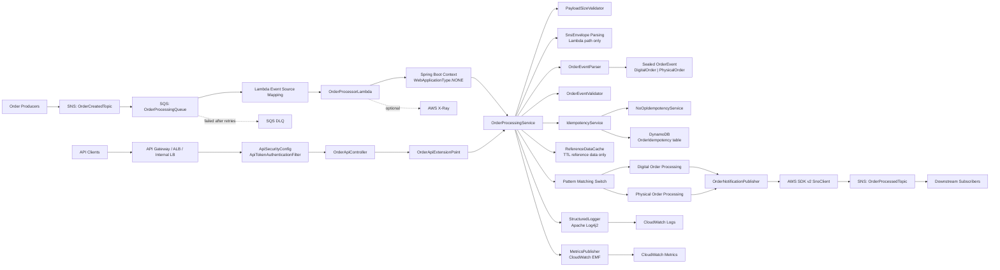

# High-Level Architecture

This system is primarily an event-driven AWS Lambda order processor, with an optional secured HTTP API extension that reuses the same processing service.

## Component Responsibilities

| Component | Responsibility |
| --- | --- |
| `OrderProcessorLambda` | AWS Lambda handler. Processes `SQSEvent` batches and returns `SQSBatchResponse` for partial batch failure handling. |
| `OrderApiController` | Optional REST adapter. Exposes `POST /api/v1/orders/process` when API mode is enabled. |
| `ApiSecurityConfig` and `ApiTokenAuthenticationFilter` | Stateless bearer-token security for the optional API path. |
| `OrderApiExtensionPoint` | API-facing port so HTTP adapters do not call the Lambda handler directly. |
| `OrderProcessingService` | Shared core workflow for Lambda and API processing. |
| `PayloadSizeValidator` | Rejects missing or oversized payloads before JSON parsing. |
| `OrderEventParser` | Parses direct order JSON into the sealed `OrderEvent` hierarchy. |
| `OrderEventValidator` | Validates required fields and type-specific fields. |
| `OrderEvent` | Sealed interface implemented by `DigitalOrder` and `PhysicalOrder`. |
| `IdempotencyService` | Event-id deduplication strategy. Implementations include no-op, in-memory test support, and DynamoDB skeleton. |
| `ReferenceDataCache` | TTL cache for reference data only. It does not cache order messages or events. |
| `OrderNotificationPublisher` | Publishes `OrderProcessedEvent` JSON to the processed SNS topic with message attributes. |
| `StructuredLogger` | Emits structured JSON logs through Apache Log4j2. |
| `MetricsPublisher` | Emits CloudWatch Embedded Metric Format metrics. |
| `SecuritySanitizer` | Masks or sanitizes sensitive values before logs and API error responses. |

## Runtime Flows

### Event-Driven Flow

1. Producers publish order-created events to `OrderCreatedTopic`.
2. SNS fans out notifications to `OrderProcessingQueue`.
3. Lambda receives SQS batches through the event source mapping.
4. `OrderProcessorLambda` iterates records and delegates each one to `OrderProcessingService`.
5. The service unwraps the SNS envelope, parses the inner order JSON, validates fields, checks idempotency, processes by order type, and publishes `OrderProcessedEvent`.
6. Failed records are returned as `BatchItemFailure`; successful records are not retried.
7. Persistently failed records move to the DLQ according to the SQS redrive policy.

### Optional API Flow

1. API clients call `POST /api/v1/orders/process` with direct order JSON.
2. The API token filter authenticates the request.
3. `OrderApiController` captures request metadata and delegates to `OrderApiExtensionPoint`.
4. `DefaultOrderApiExtensionPoint` calls the same `OrderProcessingService` used by Lambda.
5. The service validates, deduplicates, processes, publishes to SNS, and returns an API response.

## Observability

- Structured JSON logs are emitted through Apache Log4j2.
- Metrics are emitted in CloudWatch Embedded Metric Format.
- Lambda can be configured with active X-Ray tracing.
- Correlation fields include `eventId`, `correlationId`, `orderId`, `customerId`, `orderType`, SQS message id, SNS message id, API request id, and duration.
